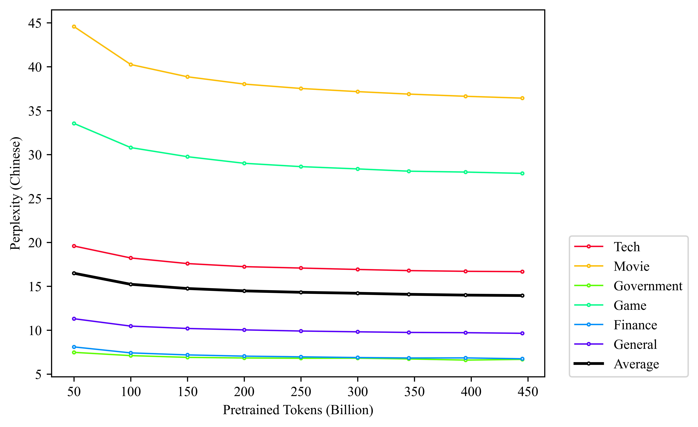
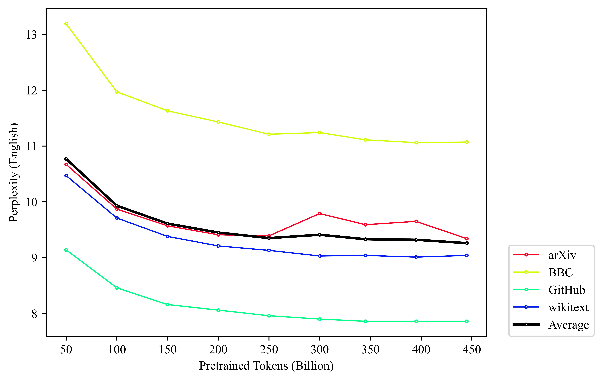

<div align="center">

# HammerLLM🔨

English | [中文](README_zh-CN.md)

</div>

<h5 align=center>

[](https://huggingface.co/collections/DataHammer/hammerllm-14b-660d227bf2e7fcbf6ceb5620)
[](https://github.com/Academic-Hammer/HammerLLM/blob/main/LICENSE)
[](https://hits.seeyoufarm.com)
</h5>

Welcome to the pre-training repository for our **s**mall-size **L**arge **L**anguage **M**odel (sLLM) with **1.4 billion** parameters, leveraged on the **Llama 2** architecture. Our sLLM exhibits advantages in following features:
1. Llama-2 Compatible LLM for Chinese and English🦙
2. Simple yet Efficient Training Codebase🚀
3. Complete Open-Source: model weights, environment, codebase, and hyper-parameters🔗
4. Comparable performance with advanced sLLMs with the similar model scale🥇
5. Tokenizer with highest compression rate and 100% Chinese character coverage🏆


## 🔥What's New!

* **[2024.4.2]** 🎉🎉🎉Release all the resources about our HammerLLM🔨, including model weights, docker environment, and training codebase

## 🧾 Next

- [ ] Continue to optimize our models on more Chinese, English, and Code tokens
- [ ] Pretrain on more Code data

## Table of Contents

- [HammerLLM🔨](#hammerllm)
  - [🔥What's New!](#whats-new)
  - [🧾 Next](#-next)
  - [Table of Contents](#table-of-contents)
  - [⚙️Inference](#️inference)
    - [Example Code](#example-code)
  - [🙌Cases](#cases)
    - [Chinese Generation](#chinese-generation)
    - [English Generation](#english-generation)
    - [Code Generation](#code-generation)
  - [🤗Pretrained Models](#pretrained-models)
  - [📊Performance](#performance)
    - [Perplexity on Latest Test Dataset](#perplexity-on-latest-test-dataset)
      - [Chinese Corpus (Skywork-ChineseDomainModelingEval)](#chinese-corpus-skywork-chinesedomainmodelingeval)
      - [English Corpus (RealTimeData-Latest Collection)](#english-corpus-realtimedata-latest-collection)
    - [📓Tokenizer](#tokenizer)
    - [⏩Acceleration](#acceleration)
  - [📈Training Progress](#training-progress)
  - [♻️Reproduce Our Work](#️reproduce-our-work)
  - [🖊️Citing](#️citing)
  - [🤝Contact Us](#contact-us)
  - [💳License](#license)
  - [💪Contributing](#contributing)

## ⚙️Inference

### Example Code
Here is a code snippet to show you how to play with our model with **HuggingFace** `transformers`:

```python
import torch
from transformers import AutoTokenizer, AutoModelForCausalLM

model_name = 'DataHammer/hammerllm-1.4b-222k'
text = '北京理工大学是'
tokenizer = AutoTokenizer.from_pretrained(model_name, use_fast=False)
# if your device donot support the bfloat16, you could remove it
model = AutoModelForCausalLM.from_pretrained(model_name, torch_dtype=torch.bfloat16)

input_ids = tokenizer(text, return_tensors='pt').input_ids
output = model.generate(
    input_ids=input_ids.cuda(),
    max_length=min(int(len(input_ids) + 100), 1024),
    do_sample=True,
    top_p=0.95
).tolist()

generation = tokenizer.decode(output[0])
print(generation)
```

## 🙌Cases
Here, we show some cases about text completion by our model on Chinese, English, and Code setting.

### Chinese Generation

```
Prompt: 北京理工大学是
Generation: <s> 北京理工大学是教育部直属全国重点大学，是我国“211工程”和“985工程”重点建设的教育部直属理工类全国重点大学，直属于工业 和信息化部，是全国首批正式获得博士学位和博士后研究资格的高校之一，首批获得公安专业硕士、公安专业博士和司法专业博士学位的22所高校之 一，是博士学位授予单位、法学（一级学科）和公安学（一级学科）博士授权高校，是一所以工为主、理工结合、多学科协调发展的全国重点大学。
北京理工大学是中央部门所属高校，中央共建高校，教育部直属高校。
一、大学院（院系）
北京理工大学现有48个博士学位授权一级学科，涵盖17个学科门类。
二、专业院系
北京理工大学设有11个一级学科博士后科研流动站
三、研究生院
北京理工大学设有29个研究所，其中国家重点实验室2个； 博士后科研流动站18个；博士后科研工作站3个。
北京理工大学研究生院招生专业：</s>
```

```
Prompt: 小米公司是一家
Generation: <s> 小米公司是一家专注于智能硬件和电子产品研发的互联网公司，公司产品包括智能手机、笔记本电脑、路由器等。小米公司一直专 注于技术创新和卓越的体验，致力于为用户提供更好的产品。
小米公司拥有一支经验丰富的研发团队，在产品开发、用户体验等方面积累了丰富的经验。公司研发团队中的大部分成员来自微软、谷歌等知名科技 公司，对互联网和移动互联网技术有着深刻理解。此外，小米公司还拥有专业的开发团队和良好的技术支持。
小米公司的核心产品之一是小米手机。小米公司的目标是让用户可以在手机中轻松分享图片、视频、音乐和音乐文件等。小米公司提供了一种简单易 用的移动媒体解决方案，让用户可以利用智能手机来轻松享受音乐、照片、视频和游戏等移动媒体内容。
小米手机还支持多种功能，包括智能语音助手、远程控制、远程定位、移动支付等。小米手机还支持各种不同的应用和服务，包括社交媒体、游戏、 视频分享、本地化服务等。
小米公司还拥有丰富的硬件产品线，包括智能手机、笔记本电脑、平板电脑、电视等。小米公司还推出了许多极具竞争力的产品，如智能手环、智能 手表等。</s>
```

### English Generation

```
Prompt: Google is
Generation: <s> Google is to deliver its latest Pixel phone to AT&T, instead of the original, cheaper Pixel 3a.
AT&T US is expected to unveil the Pixel 5a on the 8th of February, or in the evening of Friday the 12th next year.
However, it appears Google has announced the Pixel 5a as the second Pixel phone to be delivered to AT&T, rather than the original Pixel 3a.
According to a blog post published by Pixel US on 26th October, the Pixel 5a will be available on the 9th of March with a price of $599.99.
Google has also promised the Pixel 5a will be the first Pixel phone sold in the U.S., US.
In the announcement made the company is also hinting that the Pixel 5a will be available on Sprint's network, meaning the Pixel 5a won't be delivered to T-Mobile US.
A couple of months ago, the Google Pixel 5a, then known as the Pixel 4a, was revealed to the world on the 22nd of October alongside an invite for beta program for the Pixel 5a.
The Pixel 5a is believed to be the largest smartphone Pixel has ever produced.</s>
```

### Code Generation

```python
Prompt: This is a code snippet for sorting a list of number in Python language with python in-built function `sorted`:
"""python
number_list = [10, 9, 8, 7, 6, 5, 4, 3, 2, 1, 0]

Generation: <s> This is a code snippet for sorting a list of number in Python language with python in-built function `sorted`:
"""python
number_list = [10, 9, 8, 7, 6, 5, 4, 3, 2, 1, 0]
print(sorted(number_list))
"""

[`sorted`](https://docs.python.org/2/library/ordereddict.html) is a function that helps you sort a list of values in Python language.
For the list of items like number, this function is also used to sort the list.
</s>
```

## 🤗Pretrained Models

We publicly release our checkpoints on Huggingface. Welcome to test and utilize our models!

| Epoch | Step   | Pretrained tokens | Sequence Length | HuggingFace checkpoint |
| ----- | ------ | ----------------- | --------------- | ---------------------- |
| 1     | 25k    | 50B               | 2048            | [DataHammer/hammerllm-1.4b-25k](https://huggingface.co/DataHammer/hammerllm-1.4b-25k)                       |
| 1     | 50k    | 100B              | 2048            | [DataHammer/hammerllm-1.4b-50k](https://huggingface.co/DataHammer/hammerllm-1.4b-50k)                       |
| 1     | 75k    | 150B              | 2048            | [DataHammer/hammerllm-1.4b-75k](https://huggingface.co/DataHammer/hammerllm-1.4b-75k)                       |
| 1     | 100k   | 200B              | 2048            | [DataHammer/hammerllm-1.4b-100k](https://huggingface.co/DataHammer/hammerllm-1.4b-100k)                       |
| 1     | 125k   | 250B              | 2048            | [DataHammer/hammerllm-1.4b-125k](https://huggingface.co/DataHammer/hammerllm-1.4b-125k)                       |
| 1     | 150k   | 300B              | 2048            | [DataHammer/hammerllm-1.4b-150k](https://huggingface.co/DataHammer/hammerllm-1.4b-150k)                       |
| 1     | 172.5k | 345B              | 2048            | [DataHammer/hammerllm-1.4b-172k](https://huggingface.co/DataHammer/hammerllm-1.4b-172k)                       |
| 2     | 197k   | 395B      | 2048            | [DataHammer/hammerllm-1.4b-197k](https://huggingface.co/DataHammer/hammerllm-1.4b-197k)                       |
| 2     | 222k   | 445B     | 2048            | [DataHammer/hammerllm-1.4b-222k](https://huggingface.co/DataHammer/hammerllm-1.4b-222k)                       |

## 📊Performance

### Perplexity on Latest Test Dataset

For base models that are not instruct-tuned, it is important to show their perplexity on the **latest fresh test dataset**, which reflects their prediction capability without training data leakage. To achieve this goal, we compare the perplexity of our model and some famous sLLMs on famous Chinese and English latest test set. 

Our perplexity calculation follows the settings of **Skywork**, please refer to [this link](https://github.com/SkyworkAI/Skywork?tab=readme-ov-file#领域数据困惑度评估) for more details about their implementation.

Our model's performance on perplexity (ppl) testing **is second only** to the Qwen-1.5-1.8B model, outperforming Gemma-2B, InterLM2-1.8B, and MiniCPM-2B (350k). Given the fact that the our model size is smaller (1.4B < 1.8B), these experimental results are surprising.

#### Chinese Corpus ([Skywork-ChineseDomainModelingEval](https://huggingface.co/datasets/Skywork/ChineseDomainModelingEval))

|                  | Tokens | Tech      | Movie     | Government | Game      | Finance  | General  | Avg.       |
| ---------------- | ------ | --------- | --------- | ---------- | --------- | -------- | -------- | ---------- |
| Gemma-2B         | 6T     | 71.92     | 271.95    | 93.16      | 122.59    | 46.53    | 74.93    | 92.92      |
| InterLM2-1.8B    | -      | 19.20     | 36.88     | 7.18       | 29.67     | 9.51     | 11.81    | 16.03      |
| MiniCPM-2B(350k) | -      | 17.32     | 36.44     | 7.00       | 26.59     | 7.92     | 10.26    | 14.56      |
| Qwen-1.5(1.8B)   | -      | 16.88     | **33.39** | 6.63       | **25.44** | 7.43     | 9.77     | **13.80**  |
| Qwen-1.5(0.5B)   | -      | 20.70     | 41.59     | 8.24       | 31.64     | 9.41     | 11.98    | 17.13      |
| Ours             | 50B    | 19.59     | 44.58     | 7.48       | 33.55     | 8.10     | 11.31    | 16.49      |
| Ours             | 100B   | 18.23     | 40.26     | 7.11       | 30.80     | 7.42     | 10.47    | 15.23      |
| Ours             | 150B   | 17.59     | 38.86     | 6.91       | 29.76     | 7.19     | 10.20    | 14.75      |
| Ours             | 200B   | 17.24     | 38.03     | 6.84       | 29.01     | 7.05     | 10.04    | 14.48      |
| Ours             | 250B   | 17.08     | 37.53     | 6.81       | 28.63     | 6.97     | 9.91     | 14.32      |
| Ours             | 300B   | 16.92     | 37.17     | 6.82       | 28.37     | 6.89     | 9.82     | 14.21      |
| Ours             | 345B   | 16.79     | 36.89     | 6.73       | 28.11     | 6.84     | 9.75     | 14.09      |
| Ours(epoch-2)    | 395B   | 16.71     | 36.64     | **6.60**   | 28.01     | 6.85     | 9.72     | 14.00      |
| Ours(epoch-2)    | 445B   | **16.67** | 36.43     | 6.68       | 27.86     | **6.75** | **9.65** | 13.95      |


#### English Corpus ([RealTimeData-Latest Collection](https://huggingface.co/collections/RealTimeData/latest-collection-65e1c5d70e180e6263f82589))

|                  | Tokens   | arxiv-latest | bbc-latest | github-latest | wikitext-latest | Avg.       |
| ---------------- | -------- | ------------ | ---------- | ------------- | --------------- | ---------- |
| TinyLlama-1.1B   | 3T       | 8.21         | **8.27**   | **5.90**      | **7.38**        | **7.37**   |
| Gemma-2B         | 6T       | 28.96        | 37.83      | 22.10         | 28.11           | 28.72      |
| Phi-1.5(1.3B)    | 30B \* 5 | 13.08        | 14.07      | 10.42         | 15.16           | 13.06      |
| InterLM2-1.8B    | -        | **7.84**     | 8.75       | 6.87          | 8.52            | 7.96       |
| MiniCPM-2B(350k) | -        | 10.81        | 9.15       | **nan**       | 8.08            | 9.28       |
| Qwen-1.5(1.8B)   | -        | 8.70         | 8.92       | **nan**       | 8.75            | 8.79       |
| Qwen-1.5(0.5B)   | -        | 10.42        | 10.93      | **nan**       | 10.58           | 10.64      |
| Ours             | 50B      | 10.67        | 13.19      | 9.14          | 10.47           | 10.77      |
| Ours             | 100B     | 9.87         | 11.97      | 8.46          | 9.71            | 9.93       |
| Ours             | 150B     | 9.57         | 11.63      | 8.16          | 9.38            | 9.61       |
| Ours             | 200B     | 9.41         | 11.43      | 8.06          | 9.21            | 9.45       |
| Ours             | 250B     | 9.39         | 11.21      | 7.96          | 9.13            | 9.35       |
| Ours             | 300B     | 9.79         | 11.24      | 7.90          | 9.03            | 9.41       |
| Ours             | 345B     | 9.59         | 11.11      | 7.86          | 9.04            | 9.33       |
| Ours(epoch-2)    | 395B     | 9.65         | 11.06      | 7.86          | 9.01            | 9.32       |
| Ours(epoch-2)    | 445B     | 9.34         | 11.07      | 7.86          | 9.04            | 9.26       |

**NOTE**: Average PPL of Qwen-1.5 and MiniCPM models have excluded GitHub dataset for NaN value.

### 📓Tokenizer

To reveal the effectiveness of our tokenizer, we compare it with some famous open-source LLMs' tokenizers by using following metrics:
1. **Compression Rate:** We compare two kinds of compression rate of tokenizer with tokenizers of some open-source LLMs:
   * [Byte per token compression rate](https://kexue.fm/archives/9752#%E6%95%88%E6%9E%9C%E6%B5%8B%E8%AF%95) 
   * [Compared compression](https://arxiv.org/pdf/2309.16609.pdf) that measures the advantage over base Llama-2-7B tokenizer. 

2. **Chinese Character Coverage:** a good Chinese LLM should cover more characters. In our work, we leverage [vocab-coverage](https://github.com/twang2218/vocab-coverage) for computing the coverage of Chinese characters, which includes:
     * **F**irst-level **C**hinese character **C**overage (FCC) contains 3500 widely-used Chinese characters.
     * **S**econd-level **C**hinese character **C**overage (SCC) contains 3000 Chinese characters.
     * **T**hird-level **C**hinese character **C**overage (TCC) contains 1605 uncommon Chinese characters.
     
The experimental results are shown as follows:

|     Tokenizer      | FCC | SCC | TCC | Byte per Token $\uparrow$ | Comparied Compression $\downarrow$ |
|:------------------:|:-----------:|:-----------:|:-----------:|:-----------:|:----------------:|
| [Chatglm-6b](https://huggingface.co/THUDM/chatglm-6b)     |   99.97%    |   57.47%    |    2.99%    | 4.2911      |     0.5303     | 
| [Chatglm2/3-6b](https://huggingface.co/THUDM/chatglm2-6b)    |   **100.00%**  |   77.83%    |   13.89%    | 4.0329      |     0.5642     |  
| [Baichuan2-7b/14b](https://huggingface.co/baichuan-inc/Baichuan2-7B-Chat)  |   **100.00%**   |    99.8%    |   86.48%    | 4.1827      |     0.5440     | 
| [Internlm-7b/20b](https://huggingface.co/internlm/internlm-7b)   |   **100.00%**   |   65.93%    |    5.67%    | 4.3133      |     0.5276     |   
| [Qwen-7b/14b/72b](https://huggingface.co/Qwen/Qwen-7B)   |   **100.00%**   |   **100.00%**   |   **100.00%**   | 4.1326      |     0.5506     |   
| [Llama-2-7b/13b/70b](https://huggingface.co/meta-llama/Llama-2-7b-hf)  |   17.29%    |    0.13%    |    0.00%    | 2.2755      |        1.00         |  
| [Ours](https://github.com/Academic-Hammer/HammerLLM/tree/main/merge_tokenizer/internlm_merged_fast)   |    **100.00%**     |   **100.00%**    |    **100.00%**    |   **4.3143**   |     **0.5274**             | 

The experimental results reveal the advantages of our tokenizer over existing popular LLMs' tokenizers in compression rate (on Chinese, English, and Code), and the Chinese character coverage. Please refer to [REPRODUCE.md](./REPRODUCE.md) for more details about this experiment.

### ⏩Acceleration

With the help of these two stragegies, we could achieve a high throughput of **16k tokens per GPU per second** for training:
- [Flash Attention 2](https://github.com/Dao-AILab/flash-attention)
- [torch.compile](https://pytorch.org/docs/stable/torch.compiler.html)

The setting for computing the throughput is:
* ZeRO-1
* block_size: 2048
* per_device_train_batch_size: 8
* gradient_accumulation_steps: 16

| Settings                          | tokens per GPU per second |
|-----------------------------------|---------------------------|
| None                              | CUDA OOM                  |
| Flash Attention 2                 | 13k                       |
| torch.compile                     | CUDA OOM                  |
| Flash Attention 2 + torch.compile | 16k                       |

To cover more Chinese characters, our tokenizer is much larger than [TinyLlama](https://github.com/jzhang38/TinyLlama) (105789 > 32000), leading to the lower throughput than TinyLlama (16k < 24k). 

However, our throughput is comparable with TinyLlama, when the size of the tokenizer is the same (per_device_train_batch_size is set to 20 for this).

| Settings                          | tokens per GPU per second |
|-----------------------------------|---------------------------|
| Flash Attention 2 + torch.compile | 24k                       |

Unlike TinyLlama that leverages some complex the operations fusion, we achieve this throughput solely based on `torch.compile` and `flash attention 2`.


## 📈Training Progress

So far, we have optimized our model on over 400B Chinese, English, and Code tokens.
Perplexity results in Chinese and English test set demonstrate that our model has not yet converged, hence we are currently continuing to optimize it. 

We will periodically upload and make our checkpoints publicly available for analysis and research by the open-source community.

The trend of **loss** changes during the training process is shown in the following figure：


The trends of standardized **perplexity** variation based on Skywork series models on the **Skywork-ChineseDomainModelingEval** and **RealTimeData-Latest Collection** datasets are:

<table rules="none" align="center">
	<tr>
		<td>
			<center>
				
				<br/>
				<center>Chinese PPL</center>
      </center>
		</td>
		<td>
			<center>
				
        <br/>
				<center>English PPL</center>
			</center>
		</td>
	</tr>
</table>


## ♻️Reproduce Our Work

One of contriution is that we have publicly release the steps to train our model from scratch. You can refer to [this file](./REPRODUCE.md) for more details about our work.


## 🖊️Citing

```
@software{Ziao_HammerLLM_2024,
author = {Ziao, Ma and Tian, Lan and Yang, Yizhe and Yong, Hu},
month = apr,
title = {{HammerLLM}},
url = {https://github.com/Academic-Hammer/HammerLLM},
version = {1.0.0},
year = {2024}
}
```

## 🤝Contact Us

You can contact us through the email address: 
* maziaoylwt@gmail.com
* lantiangmftby@gmail.com


## 💳License


This project is released under the [MIT license](./LICENSE).

## 💪Contributing

<!-- Guidelines for how others can contribute to this repository, including coding standards, pull requests, and other relevant information. -->

We hope this documentation is helpful for understanding and utilizing our LLM model effectively. For further questions or support, please open an issue on this repository.
