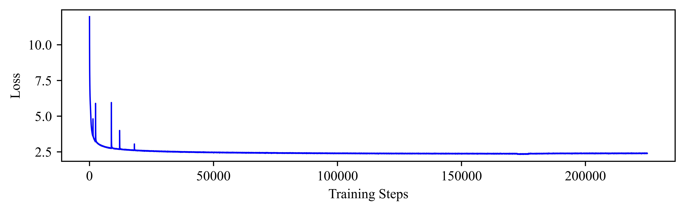
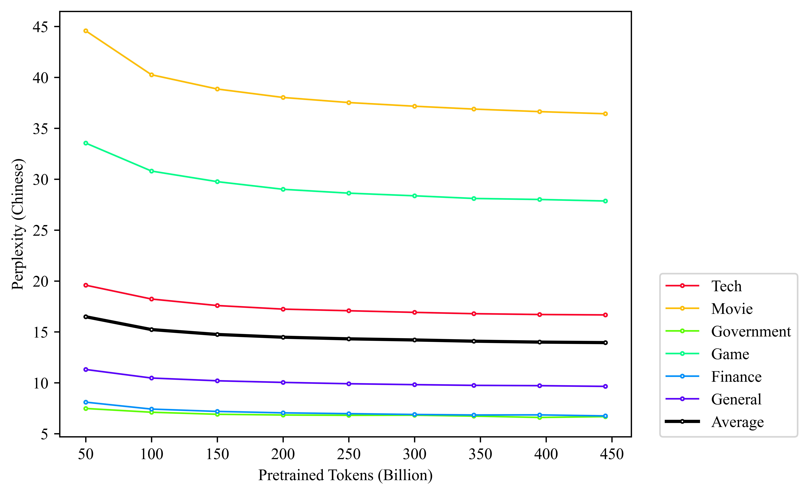

<div align="center">

# HammerLLM🔨

中文 | [English](README.md)

</div>

<h5 align=center>

[](https://huggingface.co/collections/DataHammer/hammerllm-14b-660d227bf2e7fcbf6ceb5620)
[](https://github.com/Academic-Hammer/HammerLLM/blob/main/LICENSE)
[](https://hits.seeyoufarm.com)
[](https://github.com/Academic-Hammer/HammerLLM/stargazers)
</h5>

欢迎来到我们的具有1.4B参数量的LLM —— HammerLLM的代码和资源库。和已有的small-size LLM对比下，我们的HammerLLM在以下特性方面表现出优势：
1. 兼容Llama-2的中英文预训练语言模型🦙
2. 简洁高效的训练代码库🚀
3. 完全开源：模型权重、环境、代码库和超参数🔗
4. 与具有相似模型规模的先进sLLM相比具有可比较的性能🥇
5. 具有最高压缩率和100%中文汉字覆盖率的分词器🏆


## 🔥What's New!

* **[2024.4.2]** 🎉🎉🎉发布了关于我们的HammerLLM🔨的所有资源，包括模型权重、Docker环境以及训练代码库。


## 🧾 Next

- [ ] 继续在我们的模型上训练更多的中文字符、英文字符和代码数据

## Table of Contents

- [HammerLLM🔨](#hammerllm)
  - [🔥What's New!](#whats-new)
  - [🧾 Next](#-next)
  - [Table of Contents](#table-of-contents)
  - [⚙️Inference](#️inference)
    - [Example Code](#example-code)
  - [🙌Cases](#cases)
    - [Chinese Generation](#chinese-generation)
    - [English Generation](#english-generation)
    - [Code Generation](#code-generation)
  - [🤗Pretrained Models](#pretrained-models)
  - [📊Performance](#performance)
    - [Perplexity on Latest Test Dataset](#perplexity-on-latest-test-dataset)
      - [Chinese Corpus (Skywork-ChineseDomainModelingEval)](#chinese-corpus-skywork-chinesedomainmodelingeval)
      - [English Corpus (RealTimeData-Latest Collection)](#english-corpus-realtimedata-latest-collection)
    - [📓Tokenizer](#tokenizer)
    - [⏩Acceleration](#acceleration)
  - [📈Training Progress](#training-progress)
  - [♻️Reproduce Our Work](#️reproduce-our-work)
  - [🖊️Citing](#️citing)
  - [🤝Contact Us](#contact-us)
  - [💳License](#license)
  - [💪Contributing](#contributing)

## ⚙️Inference

### Example Code
如下代码展示了如何使用**HuggingFace** `transformers`与我们的模型进行交互：


```python
import torch
from transformers import AutoTokenizer, AutoModelForCausalLM

model_name = 'DataHammer/hammerllm-1.4b-222k'
text = '北京理工大学是'
tokenizer = AutoTokenizer.from_pretrained(model_name, use_fast=False)
# if your device donot support the bfloat16, you could remove it
model = AutoModelForCausalLM.from_pretrained(model_name, torch_dtype=torch.bfloat16)

input_ids = tokenizer(text, return_tensors='pt').input_ids
output = model.generate(
    input_ids=input_ids.cuda(),
    max_length=min(int(len(input_ids) + 100), 1024),
    do_sample=True,
    top_p=0.95
).tolist()

generation = tokenizer.decode(output[0])
print(generation)
```

## 🙌Cases
我们还展示了模型在中文、英文和代码设置上作为base model完成文本补全的一些case。


### Chinese Generation

```
Prompt: 北京理工大学是
Generation: <s> 北京理工大学是教育部直属全国重点大学，是我国“211工程”和“985工程”重点建设的教育部直属理工类全国重点大学，直属于工业 和信息化部，是全国首批正式获得博士学位和博士后研究资格的高校之一，首批获得公安专业硕士、公安专业博士和司法专业博士学位的22所高校之 一，是博士学位授予单位、法学（一级学科）和公安学（一级学科）博士授权高校，是一所以工为主、理工结合、多学科协调发展的全国重点大学。
北京理工大学是中央部门所属高校，中央共建高校，教育部直属高校。
一、大学院（院系）
北京理工大学现有48个博士学位授权一级学科，涵盖17个学科门类。
二、专业院系
北京理工大学设有11个一级学科博士后科研流动站
三、研究生院
北京理工大学设有29个研究所，其中国家重点实验室2个； 博士后科研流动站18个；博士后科研工作站3个。
北京理工大学研究生院招生专业：</s>
```

```
Prompt: 小米公司是一家
Generation: <s> 小米公司是一家专注于智能硬件和电子产品研发的互联网公司，公司产品包括智能手机、笔记本电脑、路由器等。小米公司一直专 注于技术创新和卓越的体验，致力于为用户提供更好的产品。
小米公司拥有一支经验丰富的研发团队，在产品开发、用户体验等方面积累了丰富的经验。公司研发团队中的大部分成员来自微软、谷歌等知名科技 公司，对互联网和移动互联网技术有着深刻理解。此外，小米公司还拥有专业的开发团队和良好的技术支持。
小米公司的核心产品之一是小米手机。小米公司的目标是让用户可以在手机中轻松分享图片、视频、音乐和音乐文件等。小米公司提供了一种简单易 用的移动媒体解决方案，让用户可以利用智能手机来轻松享受音乐、照片、视频和游戏等移动媒体内容。
小米手机还支持多种功能，包括智能语音助手、远程控制、远程定位、移动支付等。小米手机还支持各种不同的应用和服务，包括社交媒体、游戏、 视频分享、本地化服务等。
小米公司还拥有丰富的硬件产品线，包括智能手机、笔记本电脑、平板电脑、电视等。小米公司还推出了许多极具竞争力的产品，如智能手环、智能 手表等。</s>
```

### English Generation

```
Prompt: Google is
Generation: <s> Google is to deliver its latest Pixel phone to AT&T, instead of the original, cheaper Pixel 3a.
AT&T US is expected to unveil the Pixel 5a on the 8th of February, or in the evening of Friday the 12th next year.
However, it appears Google has announced the Pixel 5a as the second Pixel phone to be delivered to AT&T, rather than the original Pixel 3a.
According to a blog post published by Pixel US on 26th October, the Pixel 5a will be available on the 9th of March with a price of $599.99.
Google has also promised the Pixel 5a will be the first Pixel phone sold in the U.S., US.
In the announcement made the company is also hinting that the Pixel 5a will be available on Sprint's network, meaning the Pixel 5a won't be delivered to T-Mobile US.
A couple of months ago, the Google Pixel 5a, then known as the Pixel 4a, was revealed to the world on the 22nd of October alongside an invite for beta program for the Pixel 5a.
The Pixel 5a is believed to be the largest smartphone Pixel has ever produced.</s>
```

### Code Generation

```python
Prompt: This is a code snippet for sorting a list of number in Python language with python in-built function `sorted`:
"""python
number_list = [10, 9, 8, 7, 6, 5, 4, 3, 2, 1, 0]

Generation: <s> This is a code snippet for sorting a list of number in Python language with python in-built function `sorted`:
"""python
number_list = [10, 9, 8, 7, 6, 5, 4, 3, 2, 1, 0]
print(sorted(number_list))
"""

[`sorted`](https://docs.python.org/2/library/ordereddict.html) is a function that helps you sort a list of values in Python language.
For the list of items like number, this function is also used to sort the list.
</s>
```

## 🤗Pretrained Models

我们已经在Huggingface上公开发布了我们的检查点。欢迎测试和利用我们的模型！


| Epoch | Step   | Pretrained tokens | Sequence Length | HuggingFace checkpoint |
| ----- | ------ | ----------------- | --------------- | ---------------------- |
| 1     | 25k    | 50B               | 2048            | [DataHammer/hammerllm-1.4b-25k](https://huggingface.co/DataHammer/hammerllm-1.4b-25k)                       |
| 1     | 50k    | 100B              | 2048            | [DataHammer/hammerllm-1.4b-50k](https://huggingface.co/DataHammer/hammerllm-1.4b-50k)                       |
| 1     | 75k    | 150B              | 2048            | [DataHammer/hammerllm-1.4b-75k](https://huggingface.co/DataHammer/hammerllm-1.4b-75k)                       |
| 1     | 100k   | 200B              | 2048            | [DataHammer/hammerllm-1.4b-100k](https://huggingface.co/DataHammer/hammerllm-1.4b-100k)                       |
| 1     | 125k   | 250B              | 2048            | [DataHammer/hammerllm-1.4b-125k](https://huggingface.co/DataHammer/hammerllm-1.4b-125k)                       |
| 1     | 150k   | 300B              | 2048            | [DataHammer/hammerllm-1.4b-150k](https://huggingface.co/DataHammer/hammerllm-1.4b-150k)                       |
| 1     | 172.5k | 345B              | 2048            | [DataHammer/hammerllm-1.4b-172k](https://huggingface.co/DataHammer/hammerllm-1.4b-172k)                       |
| 2     | 197k    | 395B       | 2048            | [DataHammer/hammerllm-1.4b-197k](https://huggingface.co/DataHammer/hammerllm-1.4b-197k)                       |
| 2     | 222k    | 445B      | 2048            | [DataHammer/hammerllm-1.4b-222k](https://huggingface.co/DataHammer/hammerllm-1.4b-222k)                       |

## 📊Performance

### Perplexity on Latest Test Dataset

对于没有进行指令微调的base model，分析它们在**高时效性测试数据**上的perplexity是重要的，这可以反映了它们在没有训练数据泄露的情况下的文本生成能力。因此，我们比较了我们的模型和一些著名的sLLM在的中文和英文最新测试集上的perplexity。

我们的实验过程和计算遵循**Skywork**的设置，您可以参考[这个链接](https://github.com/SkyworkAI/Skywork?tab=readme-ov-file#领域数据困惑度评估)以了解更多实现的细节。

我们的模型在困惑度（ppl）测试中的表现**仅次于**Qwen-1.5-1.8B模型，优于Gemma-2B、InterLM2-1.8B和MiniCPM-2B（350k）。鉴于我们的模型大小较小（1.4B小于1.8B），这些实验结果是有意思的。


#### Chinese Corpus ([Skywork-ChineseDomainModelingEval](https://huggingface.co/datasets/Skywork/ChineseDomainModelingEval))

|                  | Tokens | Tech      | Movie     | Government | Game      | Finance  | General  | Avg.       |
| ---------------- | ------ | --------- | --------- | ---------- | --------- | -------- | -------- | ---------- |
| Gemma-2B         | 6T     | 71.92     | 271.95    | 93.16      | 122.59    | 46.53    | 74.93    | 92.92      |
| InterLM2-1.8B    | -      | 19.20     | 36.88     | 7.18       | 29.67     | 9.51     | 11.81    | 16.03      |
| MiniCPM-2B(350k) | -      | 17.32     | 36.44     | 7.00       | 26.59     | 7.92     | 10.26    | 14.56      |
| Qwen-1.5(1.8B)   | -      | 16.88     | **33.39** | 6.63       | **25.44** | 7.43     | 9.77     | **13.80**  |
| Qwen-1.5(0.5B)   | -      | 20.70     | 41.59     | 8.24       | 31.64     | 9.41     | 11.98    | 17.13      |
| Ours             | 50B    | 19.59     | 44.58     | 7.48       | 33.55     | 8.10     | 11.31    | 16.49      |
| Ours             | 100B   | 18.23     | 40.26     | 7.11       | 30.80     | 7.42     | 10.47    | 15.23      |
| Ours             | 150B   | 17.59     | 38.86     | 6.91       | 29.76     | 7.19     | 10.20    | 14.75      |
| Ours             | 200B   | 17.24     | 38.03     | 6.84       | 29.01     | 7.05     | 10.04    | 14.48      |
| Ours             | 250B   | 17.08     | 37.53     | 6.81       | 28.63     | 6.97     | 9.91     | 14.32      |
| Ours             | 300B   | 16.92     | 37.17     | 6.82       | 28.37     | 6.89     | 9.82     | 14.21      |
| Ours             | 345B   | 16.79     | 36.89     | 6.73       | 28.11     | 6.84     | 9.75     | 14.09      |
| Ours(epoch-2)    | 395B   | 16.71     | 36.64     | **6.60**   | 28.01     | 6.85     | 9.72     | 14.00      |
| Ours(epoch-2)    | 445B   | **16.67** | 36.43     | 6.68       | 27.86     | **6.75** | **9.65** | 13.95      |


#### English Corpus ([RealTimeData-Latest Collection](https://huggingface.co/collections/RealTimeData/latest-collection-65e1c5d70e180e6263f82589))

|                  | Tokens   | arxiv-latest | bbc-latest | github-latest | wikitext-latest | Avg.       |
| ---------------- | -------- | ------------ | ---------- | ------------- | --------------- | ---------- |
| TinyLlama-1.1B   | 3T       | 8.21         | **8.27**   | **5.90**      | **7.38**        | **7.37**   |
| Gemma-2B         | 6T       | 28.96        | 37.83      | 22.10         | 28.11           | 28.72      |
| Phi-1.5(1.3B)    | 30B \* 5 | 13.08        | 14.07      | 10.42         | 15.16           | 13.06      |
| InterLM2-1.8B    | -        | **7.84**     | 8.75       | 6.87          | 8.52            | 7.96       |
| MiniCPM-2B(350k) | -        | 10.81        | 9.15       | **nan**       | 8.08            | 9.28       |
| Qwen-1.5(1.8B)   | -        | 8.70         | 8.92       | **nan**       | 8.75            | 8.79       |
| Qwen-1.5(0.5B)   | -        | 10.42        | 10.93      | **nan**       | 10.58           | 10.64      |
| Ours             | 50B      | 10.67        | 13.19      | 9.14          | 10.47           | 10.77      |
| Ours             | 100B     | 9.87         | 11.97      | 8.46          | 9.71            | 9.93       |
| Ours             | 150B     | 9.57         | 11.63      | 8.16          | 9.38            | 9.61       |
| Ours             | 200B     | 9.41         | 11.43      | 8.06          | 9.21            | 9.45       |
| Ours             | 250B     | 9.39         | 11.21      | 7.96          | 9.13            | 9.35       |
| Ours             | 300B     | 9.79         | 11.24      | 7.90          | 9.03            | 9.41       |
| Ours             | 345B     | 9.59         | 11.11      | 7.86          | 9.04            | 9.33       |
| Ours(epoch-2)    | 395B     | 9.65         | 11.06      | 7.86          | 9.01            | 9.32       |
| Ours(epoch-2)    | 445B     | 9.34         | 11.07      | 7.86          | 9.04            | 9.26       |

**NOTE**: Average PPL of Qwen-1.5 and MiniCPM models have excluded GitHub dataset for NaN value.

### 📓Tokenizer

为了揭示我们分词器的有效性，我们使用以下指标将其与一些著名开源LLM的分词器进行比较：
1. **压缩率：**我们将分词器的两种压缩率与一些开源LLM的分词器进行比较：
   * [Byte per token压缩率](https://kexue.fm/archives/9752#%E6%95%88%E6%9E%9C%E6%B5%8B%E8%AF%95)
   * [基于比较的压缩率](https://arxiv.org/pdf/2309.16609.pdf)，测量与基础Llama-2-7B分词器相比的优势。
   
2. **汉字覆盖率：**一个好的中文LLM应该覆盖更多的汉字。在我们的工作中，我们使用[vocab-coverage](https://github.com/twang2218/vocab-coverage)来计算汉字的覆盖率，包括：
     * **一级汉字覆盖率**（FCC）包含3500个广泛使用的汉字。
     * **二级汉字覆盖率**（SCC）包含3000个汉字。
     * **三级汉字覆盖率**（TCC）包含1605个不常见的汉字。

实验结果如下所示：

|     Tokenizer      | FCC | SCC | TCC | Byte per Token $\uparrow$ | Comparied Compression $\downarrow$ |
|:------------------:|:-----------:|:-----------:|:-----------:|:-----------:|:----------------:|
| [Chatglm-6b](https://huggingface.co/THUDM/chatglm-6b)     |   99.97%    |   57.47%    |    2.99%    | 4.2911      |     0.5303     | 
| [Chatglm2/3-6b](https://huggingface.co/THUDM/chatglm2-6b)    |   **100.00%**  |   77.83%    |   13.89%    | 4.0329      |     0.5642     |  
| [Baichuan2-7b/14b](https://huggingface.co/baichuan-inc/Baichuan2-7B-Chat)  |   **100.00%**   |    99.8%    |   86.48%    | 4.1827      |     0.5440     | 
| [Internlm-7b/20b](https://huggingface.co/internlm/internlm-7b)   |   **100.00%**   |   65.93%    |    5.67%    | 4.3133      |     0.5276     |   
| [Qwen-7b/14b/72b](https://huggingface.co/Qwen/Qwen-7B)   |   **100.00%**   |   **100.00%**   |   **100.00%**   | 4.1326      |     0.5506     |   
| [Llama-2-7b/13b/70b](https://huggingface.co/meta-llama/Llama-2-7b-hf)  |   17.29%    |    0.13%    |    0.00%    | 2.2755      |        1.00         |  
| [Ours](https://github.com/Academic-Hammer/HammerLLM/tree/main/merge_tokenizer/internlm_merged_fast)   |    **100.00%**     |   **100.00%**    |    **100.00%**    |   **4.3143**   |     **0.5274**             | 

实验结果揭示了我们的分词器在压缩率（对中文、英文和代码数据）和汉字覆盖率方面，相较于现有流行LLM的分词器的优势。更多细节请参见[REPRODUCE_zh-CN.md](./REPRODUCE_zh-CN.md).


### ⏩Acceleration


在以下两种策略的帮助下，我们能够实现per second per GPU **16k token**的高吞吐量进行训练：
- [Flash Attention 2](https://github.com/Dao-AILab/flash-attention)
- [torch.compile](https://pytorch.org/docs/stable/torch.compiler.html)

计算吞吐量的设置如下：
* ZeRO-1
* block_size: 2048
* per_device_train_batch_size: 8
* gradient_accumulation_steps: 16


| Settings                          | tokens per GPU per second |
|-----------------------------------|---------------------------|
| None                              | CUDA OOM                  |
| Flash Attention 2                 | 13k                       |
| torch.compile                     | CUDA OOM                  |
| Flash Attention 2 + torch.compile | 16k                       |

为了覆盖更多的汉字，我们的分词器比[TinyLlama](https://github.com/jzhang38/TinyLlama)大得多（105789 > 32000），导致吞吐量低于TinyLlama（16k < 24k）。

然而，当分词器大小相同时，我们的吞吐量与TinyLlama相当（为此将per_device_train_batch_size设置为20）。


| Settings                          | tokens per GPU per second |
|-----------------------------------|---------------------------|
| Flash Attention 2 + torch.compile | 24k                       |

与利用一些复杂操作融合的TinyLlama不同，我们只通过结合`torch.compile`和`flash attention 2`即可实现了这一吞吐量。


## 📈Training Progress

到目前为止，我们已经在超过400B的中文字符、英文字符和代码字符上优化了我们的模型。中文和英文测试集的困惑度结果表明，我们的模型尚未收敛，因此我们目前正在继续预训练过程。

我们将定期上传并公开发布我们的checkpoint，以供开源社区分析和研究。训练过程中**损失**的变化趋势在下图中显示：


基于Skywork系列模型，在**Skywork-ChineseDomainModelingEval**和**RealTimeData-Latest Collection**数据集上的标准化后的**perplexity**变化趋势如下：

<table rules="none" align="center">
	<tr>
		<td>
			<center>
				
				<br/>
				<center>中文 Perplexity</center>
      </center>
		</td>
		<td>
			<center>
				
        <br/>
				<center>英文 Perplexity</center>
			</center>
		</td>
	</tr>
</table>

## ♻️Reproduce Our Work

我们的贡献之一在于公开了从头完成预训练的完整流程。你可以在[该文件](./REPRODUCE_zh-CN.md)中找到所有的信息。

## 🖊️Citing

```
@software{Ziao_HammerLLM_2024,
author = {Ziao, Ma and Tian, Lan and Yang, Yizhe and Yong, Hu},
month = apr,
title = {{HammerLLM}},
url = {https://github.com/Academic-Hammer/HammerLLM},
version = {1.0.0},
year = {2024}
}
```

## 🤝Contact Us

您可以通过如下邮箱联系到我们: 
* maziaoylwt@gmail.com
* lantiangmftby@gmail.com


## 💳License


本项目基于 MIT 开源协议[license](./LICENSE).

## 💪Contributing

<!-- Guidelines for how others can contribute to this repository, including coding standards, pull requests, and other relevant information. -->

我们希望这份文档可以对您理解和使用我们的HammerLLM模型有所帮助。如有进一步的问题或需要支持，请在此仓库中提交issue。
